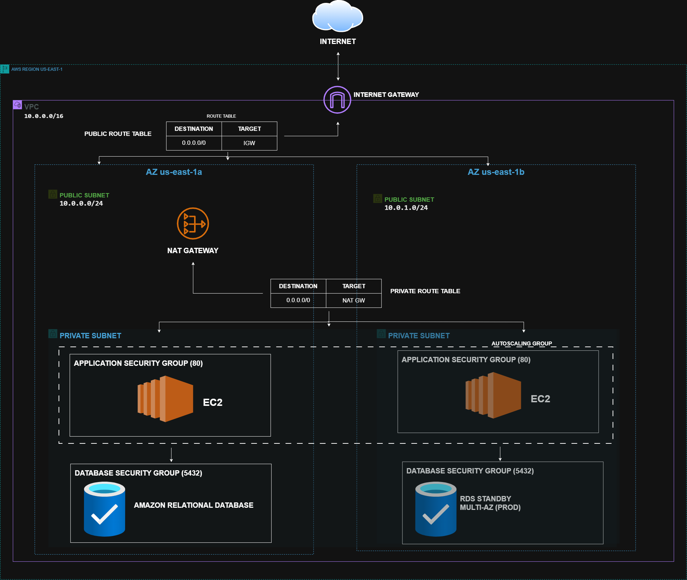
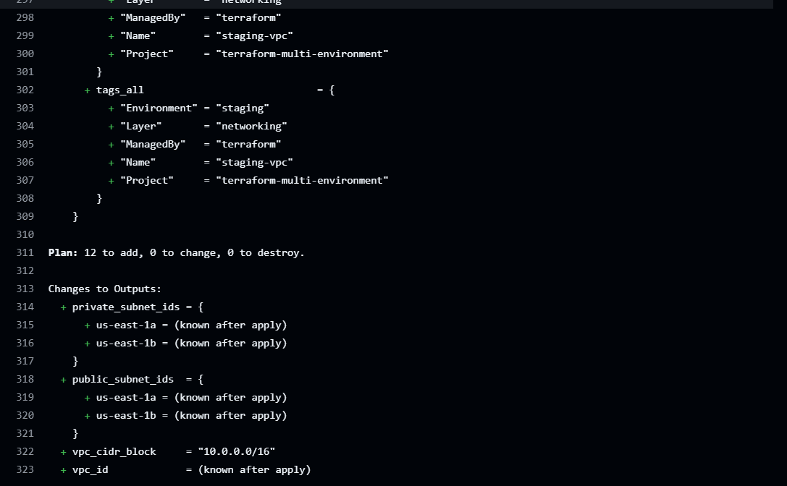

# Terraform Multi-Environment Infrastructure

Terraform code that builds the same three-tier AWS network (networking → compute → database) for **dev**, **staging** and **prod**. GitHub Actions deploys it, and each layer's state is stored remotely in S3.




---

## How traffic flows

- **Inbound / outbound internet traffic for public resources:** Internet ⇄ Internet Gateway ⇄ public route table ⇄ public subnets.
- **Outbound traffic from private resources** (OS updates, package downloads): private subnet  → private route table → NAT Gateway → Internet Gateway → Internet. Nothing on the internet can start a connection back in through the NAT.
- **App to database:** EC2 instances  → TCP 5432 → RDS . The database security group only accepts traffic from the app security group.

## The building blocks

### 1. AWS Region — `us-east-1`
A Region is a geographic area containing several isolated data centres. Everything in this project is created in `us-east-1`.

### 2. VPC — `10.0.0.0/16`
A Virtual Private Cloud is your own private, isolated network inside AWS. The `/16` range provides 65,536 private IP addresses for all the subnets below. DNS support and DNS hostnames are enabled so resources can reach each other by name.
*Code:* `aws_vpc.this` in [modules/networking/main.tf](infrastructure/modules/networking/main.tf)

### 3. Availability Zones
An Availability Zone (AZ) is one or more physically separate data centres inside the Region. Spreading resources across **two AZs** (`az_count = 2`) means the system survives if one AZ fails. Terraform picks the first two available AZs at plan time. The diagram shows `us-east-1a`/`1b` as examples.

### 4. Internet Gateway (IGW)
The VPC's door to the public internet. It handles traffic in both directions, but only for subnets whose route table points at it.
*Code:* `aws_internet_gateway.this`

### 5. Public route table
A route table is the set of rules that decide where traffic leaving a subnet goes. This one sends **all non-local traffic (`0.0.0.0/0`) to the IGW**. That route is what makes a subnet "public". Both public subnets are associated with it.
*Code:* `aws_route_table.public`, `aws_route_table_association.public`

### 6. Public subnets — `10.0.0.0/24`, `10.0.1.0/24`
One per AZ. Instances launched here get a public IP automatically (`map_public_ip_on_launch = true`). These subnets hold the NAT Gateway. They are also where internet-facing resources such as a load balancer would go.

### 7. NAT Gateway + Elastic IP
Network Address Translation lets resources in **private** subnets make outbound internet connections while blocking inbound connections from the internet. It sits in the first public subnet and has a fixed public address (Elastic IP).
It is only created when `enable_nat_gateway = true`, which is currently **dev only** (see 15).
*Code:* `aws_nat_gateway.this`, `aws_eip.nat`

### 8. Private route table
Sends `0.0.0.0/0` to the NAT Gateway instead of the IGW. When NAT is disabled this route is not created, and the private subnets have **no internet access at all**, only traffic inside the VPC.
*Code:* `aws_route_table.private`

### 9. Private subnets — `10.0.10.0/24`, `10.0.11.0/24`
One per AZ, with no public IPs. The application servers and the database both live here, so nothing on the internet can reach them directly.

### 10. Compute layer — security group, launch template, Auto Scaling Group
- **Security group:** a stateful firewall attached to each instance. The app security group allows **TCP 80** from `allowed_ingress_cidrs` and allows all outbound traffic.
- **Launch template:** the blueprint for each EC2 instance (AMI, `t3.micro`, security group). It enforces **IMDSv2** so instance credentials are harder to steal.
- **Auto Scaling Group (ASG):** keeps between 1 and 4 instances running (2 desired), spread across both private subnets. It replaces unhealthy instances automatically.

*Code:* [modules/compute/main.tf](infrastructure/modules/compute/main.tf)

### 11. Database layer — DB subnet group, security group, RDS
- **DB subnet group:** tells RDS which subnets it may use (both private subnets), so it can fail over to the other AZ.
- **DB security group:** allows PostgreSQL (**TCP 5432**) **only from the app security group**, not from an IP range. Only the app servers can reach the database.
- **RDS PostgreSQL 15.4:** a managed database with encrypted storage and `publicly_accessible = false`. In prod `multi_az = true`, so AWS keeps a synchronous **standby** copy in the second AZ and fails over to it automatically. Dev and staging run a single instance.

*Code:* [modules/database/main.tf](infrastructure/modules/database/main.tf)

### 12. Terraform remote state
Terraform records what it has built in a *state file*. Instead of keeping it on a laptop, it is stored centrally (resources defined in [providers.tf](infrastructure/providers.tf)):

| Resource | Purpose |
|---|---|
| **S3 bucket** `terraform-platform-state-bucket-all-environment` | Holds one state file per environment and layer at `<env>/<layer>/terraform.tfstate`. Versioning is on (old states can be recovered), it is AES-256 encrypted, all public access is blocked, and `prevent_destroy` protects it from deletion. |
| **DynamoDB table** `terraform-platform-state-lock` | A lock with `LockID` as the key. Only one `plan`/`apply` can touch a given state at a time, so two pipelines can't corrupt it. |

### 13. GitHub Actions + OIDC
CI/CD runs from [.github/workflows](.github/workflows):

- **`terraform-ci.yaml`:** format check (`terraform fmt -check`) and plan.
- **`terraform-dev.yaml`, `terraform-staging.yaml`, `terraform-prod.yaml`:** deploy on pushes to `develop`, `staging` and `production`.
- **`terraform.yaml`:** the reusable worker that each environment's workflow calls once per layer.

The workflows sign in to AWS with **OIDC**: GitHub issues a short-lived token, and AWS exchanges it for temporary credentials of an IAM role (`AWS_ROLE_TO_ASSUME`). No long-lived AWS keys are stored in GitHub.

### 14. Deploy order — networking → compute → database
Each layer is a separate Terraform root with its own state, under `infrastructure/environment/<env>/<layer>`. Later layers read earlier layers' outputs with `terraform_remote_state`:

1. **Networking** outputs the VPC id and the subnet ids.
2. **Compute** uses those, and outputs the app security group id.
3. **Database** uses the VPC and private subnets from networking, plus the app security group id from compute.

Splitting the layers keeps each change small. For example, resizing the database never touches the network.

### 15. Environment differences
All three environments use the same CIDRs and the same compute sizing. They differ in:

| Env | NAT Gateway | DB instance class | DB storage | Multi-AZ |
|---|---|---|---|---|
| dev | off | `db.t3.micro` | 20 GB | no |
| staging | off | `db.t3.small` | 50 GB | no |
| prod | on | `db.t3.medium` | 100 GB | yes |

The values are written into `terraform.tfvars` at deploy time by `infrastructure/script/<env>/<layer>-tfvars.sh`.

> **Note:** with NAT off (dev and staging), instances in the private subnets cannot reach the internet, for example for OS updates or pulling packages. Turn on `enable_nat_gateway` in those environments if they need it.

---

## Repository layout

```
infrastructure/
├── providers.tf            # S3 state bucket + DynamoDB lock table
├── modules/
│   ├── networking/         # VPC, subnets, IGW, NAT, route tables
│   ├── compute/            # app SG, launch template, ASG
│   └── database/           # DB SG, DB subnet group, RDS
├── environment/
│   └── <dev|staging|prod>/<networking|compute|database>/   # one root module + backend per layer
└── script/
    └── <dev|staging|prod>/<layer>-tfvars.sh               # generates terraform.tfvars
docs/
├── architecture.svg        # diagram source
└── architecture.png        # rendered diagram
```
